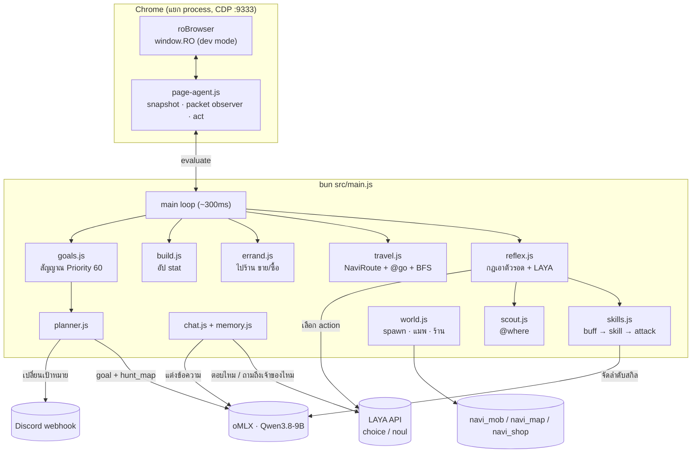
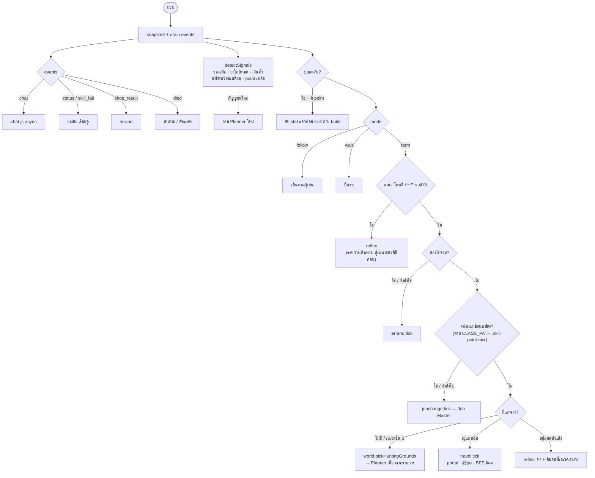
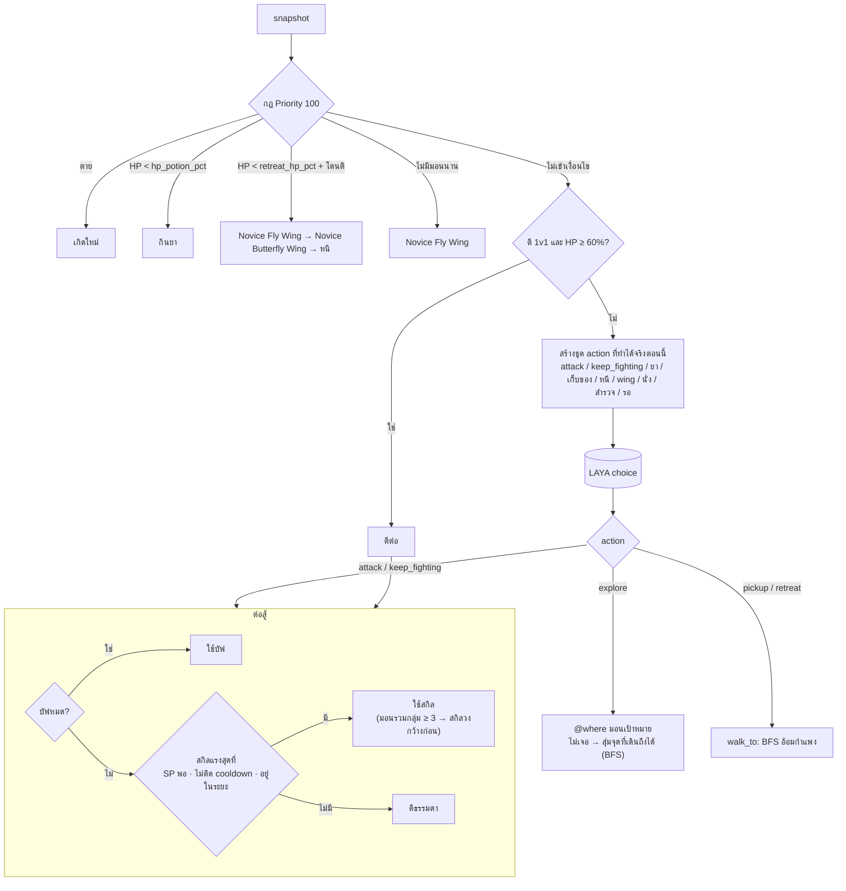
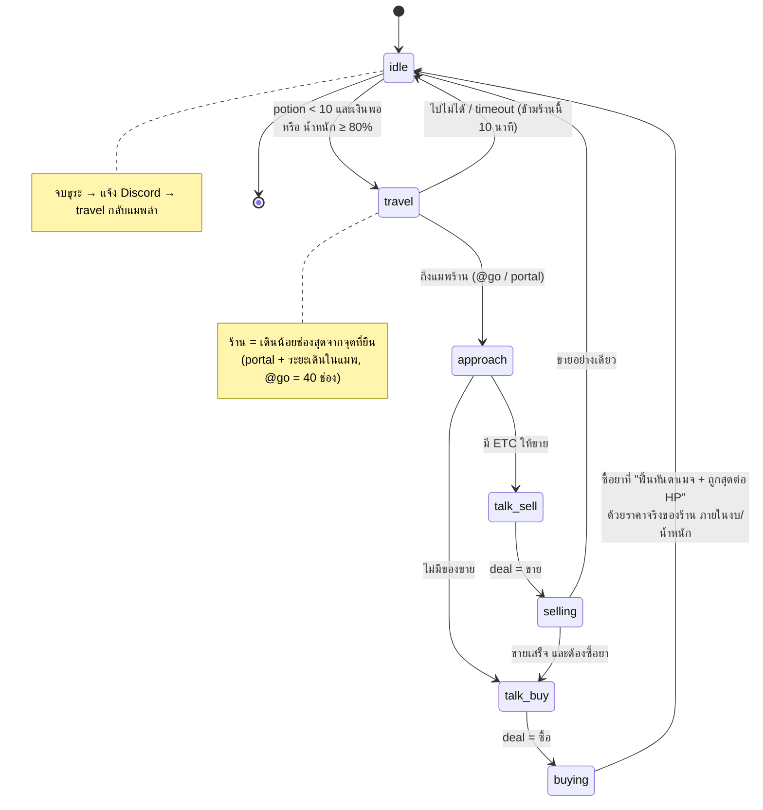
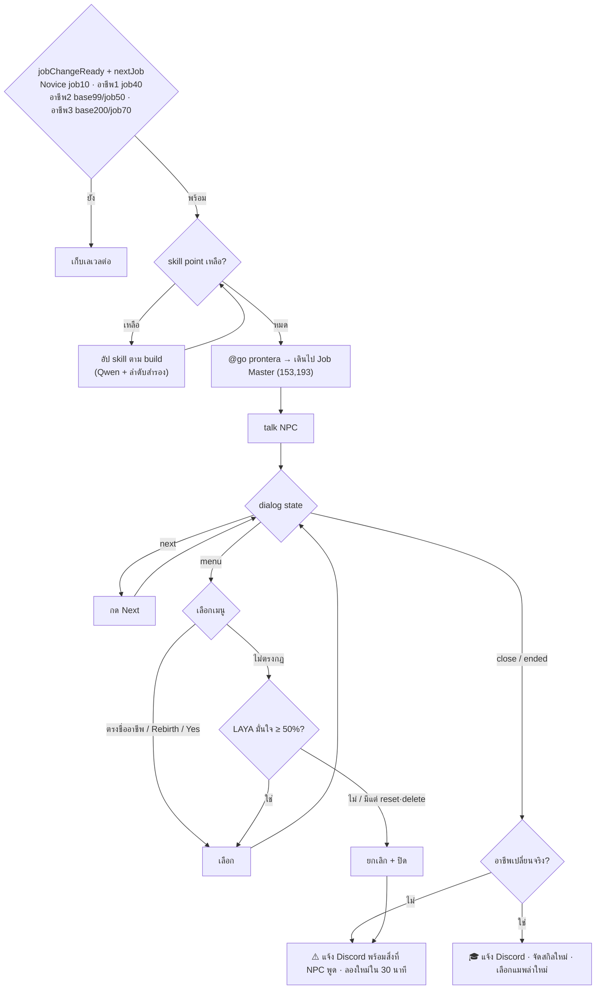
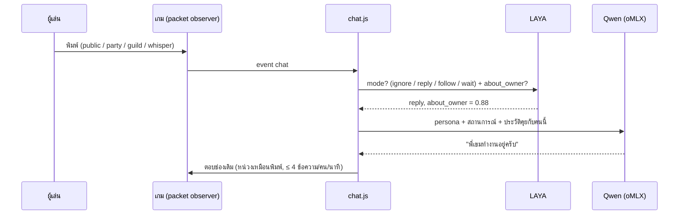

# morroc101-laya

AI เล่น Ragnarok Online (Morroc 101, roBrowser) ใน browser ด้วยสมอง 3 ชั้นตามเอกสารระบบ:
**Planner** (oMLX · Qwen) วางเป้าหมาย · **LAYA** ตัดสินใจทีละ tick · **Chat** (oMLX) คุยกับผู้เล่น

เป้าหมายทั้งหมดและสถานะว่าทำได้แค่ไหน: [docs/GOALS.md](docs/GOALS.md)

## รัน

```sh
bun install
cp .env.example .env     # ใส่ LAYA_API_KEY, OMLX_API_KEY, DISCORD_WEBHOOK_URL
bun test                 # unit test (ไม่ต่อเน็ต)
bun run check            # เรียก LAYA + oMLX จริงด้วย prompt จริง
bun run check:browser    # เปิดเกม headless เช็คว่า window.RO + packet observer ขึ้น
bun start                # เปิด/เชื่อม Chrome อัตโนมัติ (CDP 9333) → ล็อกอินเองครั้งแรก → agent เริ่มเมื่อเข้าแมพ
```

Bot เชื่อม Chrome เดิมที่พอร์ต 9333 ถ้ายังไม่เปิดจะเปิดเองด้วยโปรไฟล์ `.browser-profile` แล้วรอพอร์ตพร้อม ไม่ต้องพิมพ์คำสั่งเปิด Chrome แยก หากติดตั้ง Chrome ในตำแหน่งอื่นให้ตั้ง `CHROME_PATH` เป็นพาธไฟล์โปรแกรม

Ctrl+C หยุดแค่ agent, session เกมยังอยู่ `bun start` ใหม่ต่อแท็บเดิมได้ทันที
(อย่ากด F5 ตอน agent ไม่รัน: หน้าเกมจะโหลดใหม่โดยไม่มี `window.RO` และต้องล็อกอินใหม่)

### ให้ Claude Code แก้โค้ดเองจากความผิดพลาด

```
bot (bun run dev) ──เขียน──▶ logs/incidents.jsonl ◀──เฝ้าดู── Claude Code session
      ▲                                                      │ อ่าน incident + log รอบๆ
      └──── bun --watch restart เอง เมื่อไฟล์ใน src เปลี่ยน ◀──┘ แก้โค้ด → bun test ผ่าน
```

- `bun run dev` = `bun --watch src/main.js` — โค้ดเปลี่ยนเมื่อไร bot restart เอง (browser + session เกมยังอยู่)
- ความผิดพลาดที่ควรแก้โค้ด (loop_error, errand_failed, jobchange_failed, travel_failed, …) ถูกเขียนแยกไว้ที่ `logs/incidents.jsonl`
- ใน Claude Code session สั่ง `/loop` ให้เฝ้าไฟล์นั้น เช่น
  `/loop 5m อ่าน logs/incidents.jsonl ที่ใหม่กว่ารอบที่แล้ว ถ้ามี ให้หาสาเหตุจาก logs/decisions.jsonl แก้โค้ด รัน bun test ให้ผ่านก่อนบันทึก`

## ภาพรวม



## ลำดับการตัดสินใจในแต่ละ tick



## Reflex: เลือก action



## ธุระไปร้าน (ซื้อ/ขาย)



## เปลี่ยนอาชีพ + คุย NPC

สาย (`CLASS_PATH`): **Merchant → Blacksmith → High Novice (rebirth) → High Merchant → Whitesmith → Mechanic → Meister** · build `axe_meister` (ขวาน 2 มือ)



ทุกบทสนทนาบันทึกที่ `logs/npc/<ชื่อ NPC>.jsonl` — อ่านได้ว่า NPC พูดอะไรและ agent เลือกอะไร

## แชท



## ไฟล์

| ไฟล์ | หน้าที่ |
| --- | --- |
| `src/main.js` | loop หลัก, event routing, mode, hunt/travel/errand, สัญญาณ, อัป stat |
| `src/page-agent.js` | รันในหน้าเกม: snapshot, ดัก packet (แชท/stat/skill/status/shop), BFS เดิน, act |
| `src/browser.js` | ต่อ Chrome ที่เปิดไว้ผ่าน CDP, บังคับ dev mode, helper |
| `src/reflex.js` | กฎเอาตัวรอด + ถาม LAYA + สำรวจ + ต่อสู้ |
| `src/skills.js` | ลำดับสกิล (Qwen + fallback), เลือกบัฟ/สกิล, เรียนรู้ buff ↔ status, ลำดับอัป skill point |
| `src/build.js` | สัดส่วน stat (`BUILD`, ค่าเริ่ม `axe_meister`), เลือกแต้มถัดไป |
| `src/world.js` | ข้อมูล spawn/แมพ/ร้าน/NPC, เลือกแมพล่า, ต้นทุนเดินทางเป็นช่อง (Dijkstra) |
| `src/travel.js` | เดินข้ามแมพตาม NaviRoute (portal + @go), BFS อ้อมเมื่อเดินไม่คืบ |
| `src/errand.js` | ไป Tool Dealer ที่ใกล้สุด (ระยะเดินจริง) ขาย ETC + ซื้อ potion |
| `src/potions.js` | เลือกชนิดยาจากดาเมจที่โดน vs HP/วิ ที่ยาฟื้น, เลือกขวดที่จะกิน, วัดดาเมจ |
| `src/scout.js` | `@where` / `@mobsearch` หาพิกัดมอน |
| `src/npc.js` | คุย NPC ทั่วไป: Next / เมนู / input / Close, ตัวเลือกต้องห้าม, transcript |
| `src/jobchange.js` | ไป Job Master เปลี่ยนอาชีพตาม `CLASS_PATH` แล้วเช็คผล |
| `src/goals.js` | เป้าหมายจากเอกสาร, อาชีพ, เงื่อนไขเปลี่ยนอาชีพ, สัญญาณ |
| `src/planner.js` / `src/prompts.js` | Planner (Qwen) + system prompt / persona แชท |
| `src/chat.js` / `src/memory.js` | ตอบแชท + ความจำรายผู้เล่น |
| `src/notify.js` | Discord webhook เมื่อเปลี่ยนเป้าหมาย/ย้ายที่ล่า |
| `src/laya.js` / `src/llm.js` | client LAYA (`/v1/systemone`) และ oMLX (`/v1/chat/completions`) |
| `test/` | unit test ทุกส่วน (mock `window.RO`, LAYA, LLM) |
| `logs/decisions.jsonl` | log ทุก action / แชท / แผน / ธุระ |

## กฎของเจ้าของที่ฝังไว้

- ใช้ **Novice Fly Wing** เท่านั้น (ไม่ใช้/ไม่ซื้อ Fly Wing), ไม่ใช้ Butterfly Wing กลับเมือง — ใช้ `@go`
- ถูกถามถึงเจ้าของ → "พี่เขมทำงานอยู่"
- ไม่ขายการ์ด/อุปกรณ์/ของที่สวม, เก็บเงินสำรองไว้เสมอ
