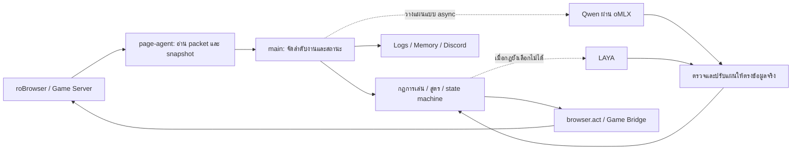
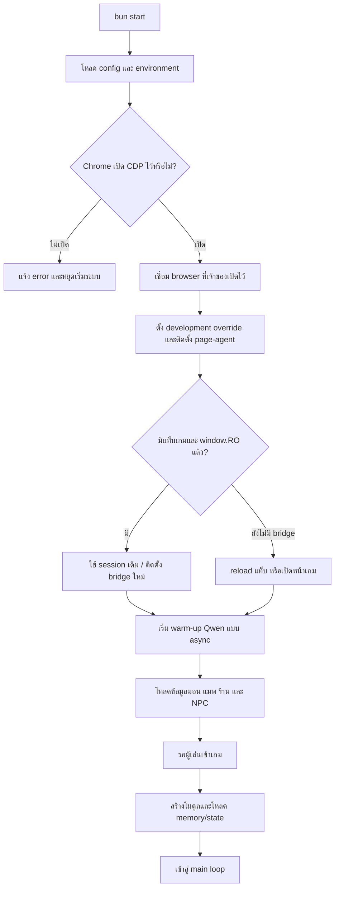
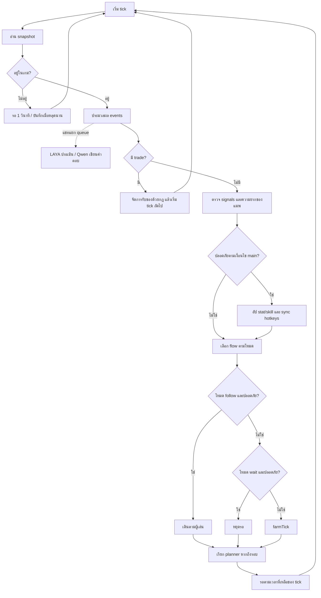
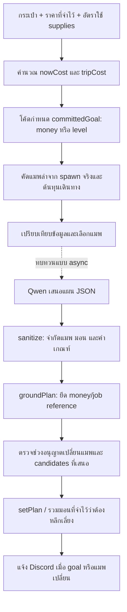
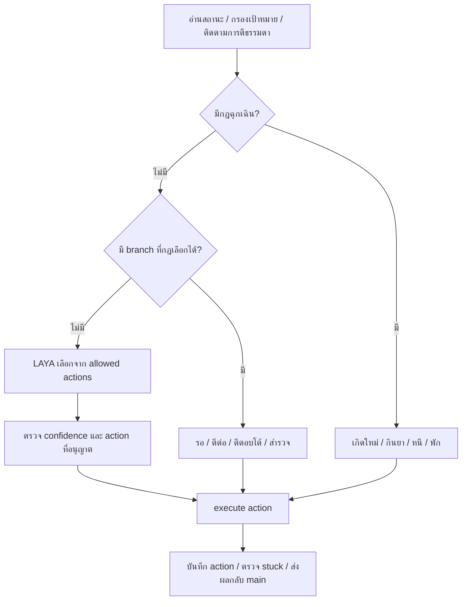
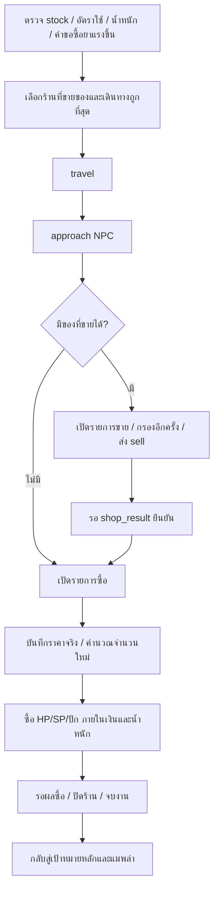
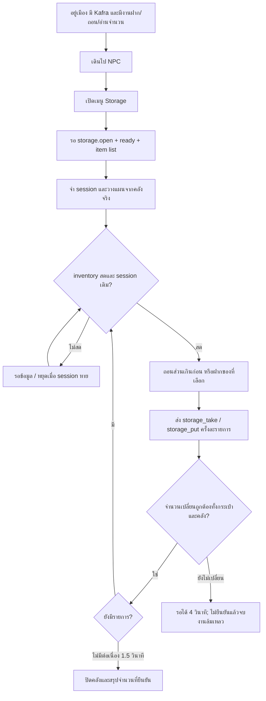
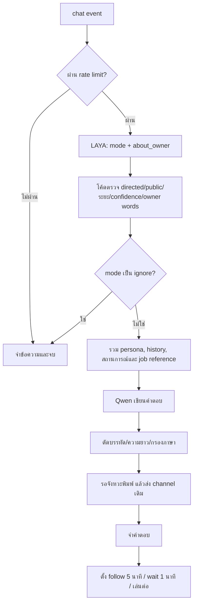

# Flow การทำงานของ Morroc101 LAYA Agent

## สถานะการย้ายผู้ตัดสินใจล่าสุด — ยังไม่ครบทุกระบบ

ส่วนอธิบายเดิมด้านล่างเป็นผลสำรวจรุ่นก่อนการย้ายอำนาจตัดสินใจ โดยเฉพาะลำดับ main, committedGoal, แผนสกิล และ logging ให้ยึดสถานะล่าสุดต่อไปนี้แทน:

- Qwen ส่งทั้ง goal/objective และ current_task { kind, objective, done_when } โค้ดตรวจ schema, แมพ/มอนจากรายการจริง และเงื่อนไขเงิน/อาชีพ ไม่เขียนทับเป็น goal หรือแมพที่โค้ดเลือกเอง
- main เริ่มเฉพาะ current_task: hunt, supply, storage, heal, review_items, equip, build, job_change หรือ rest; ทำ transaction ที่เริ่มแล้วจนได้ผล แล้วใช้ผลเพื่อวางแผนขั้นถัดไป งานที่จบ/เริ่มไม่ได้จะไม่เริ่มซ้ำโดยไม่มีแผนใหม่
- ข้อมูลตาย ติดสถานะ ดาเมจ ยา และการเดินทางล้มเหลวเป็นบริบทในการวางแผน; ไม่บังคับลดระดับมอนหรือสั่งซื้อยาที่โค้ดเลือกเอง
- LAYA เลือก stat/skill ที่จะอัป อุปกรณ์ที่จะสวม การพัก และประเภทการใช้สกิล ไม่มีแผนอัปสกิลสำรองจากลำดับ hardcode ใน runtime main
- ตรวจสถานะล่าสุดก่อนใช้แผน/อัปแต้ม/สวมของ; เมื่อโมเดลไม่ตอบหรือคำตอบไม่ผ่าน ให้รอคำตอบใหม่ ไม่สร้างเป้าหมายหรือภารกิจแทน
- logger บันทึกเฉพาะ model_call/model_result/model_error และผลตรวจแผน Qwen; warm-up, action ปกติ และ NPC transcript ไม่เขียนลง log
- LAYA เลือก NPC จาก directory และตัวที่เห็นจริง, เลือก Next/เมนูจริงของ Job Master/Healer/Kafra/Warper; reference ใช้ตรวจเมนูที่อนุญาต ไม่เลือกคำตอบแทน โมเดลตอบผิด index/เมนูเปลี่ยนระหว่างรอจะไม่ส่ง packet; input ที่ยังไม่มีตัวเลือกยืนยันจะจบงานแบบไม่สำเร็จ ไม่ใส่ 0 หรือข้อความว่างเอง
- LAYA เลือก Warper เทียบเส้นทางปกติ, เดินหรืออนุญาต @go, ปีกแต่ละ stack เทียบการเดินต่อ; วาร์ป/เดินไม่สำเร็จกลับมาขอการตัดสินใจใหม่ มีขอบเขต timeout และตรวจตำแหน่ง/ไอเทมก่อนใช้ปีก
- LAYA เลือกเจตนาซื้อ/ขาย เมือง ร้าน จำนวนขาย และตะกร้าซื้อที่ผ่านสูตรเงิน/น้ำหนัก 45%; ตรวจ inventory/ราคา/เงินซ้ำก่อนส่งธุรกรรม ยืนยันขายจาก ACK ก่อนนับยอด และไม่เสนอขายยาเก่าเพียงบางส่วนเมื่อมียาทดแทนแล้ว
- เก็บบริบทและตัวเลือกใน model_call เพื่ออ่านผล model_result ที่อ้าง option/index ย้อนกลับได้ โดยไม่เปิด log action ปกติ
- **ยังค้าง:** reflex ยังมีกฎฉุกเฉิน การเลือก target/ยา/สกิลและ fallback; ยังต้องตรวจ choices ใน hotkeys, identify/review, chat/social, ตัวกรอง candidate และเส้นทาง execution ทั้งระบบ พร้อมตรวจ integration หลังเปลี่ยน API เป็น async ระบบอนุมัติอัตโนมัติปฏิเสธการถอดกฎฉุกเฉินและ fallback เพราะความเสี่ยงเสียตัวละคร/ทรัพยากร จึงยังไม่ได้แก้ส่วนนั้น
- หลักฐานเพิ่ม: inline mocks ของ NPC/Warper reference, route/@go/ปีก, การเลือกร้านและจำนวนซื้อขาย, เมนู/เงิน/ตำแหน่งที่เปลี่ยนระหว่างรอ, ยาทดแทน และกฎฉุกเฉินระหว่าง transaction ผ่าน; ไม่ได้แก้ test files เดิมเพื่อให้ตาม API ใหม่ และยังไม่อ้างว่า full suite หรือเล่นจริงผ่าน
- หลักฐานรอบนี้: build ผ่านเมื่อ externalize packages; inline mocks ผ่านสำหรับ Qwen schema/เงิน/task dispatch, logging และ LAYA skill classification/toggle/cooldown; regression Game Bridge/gear/hotkeys 36 ผ่าน ไม่ได้ทดสอบเล่นเกมจริงหรืออ้างว่า full suite ผ่าน

---

อ้างอิงโค้ดใน working tree ที่อ่านวันที่ 2 ตุลาคม 2026 รวมการเปลี่ยนแปลงที่ยังไม่ได้ commit เอกสารนี้อธิบายพฤติกรรมจากโค้ด ไม่ใช่ผลการทดลองเล่นจริง ค่าต่าง ๆ เป็นค่าเริ่มต้นหรือค่าคงที่ ณ วันที่อ่าน

ระบบแบ่งหน้าที่เป็น **กฎในโค้ดสำหรับควบคุมการเล่นและตรวจผล**, **Qwen สำหรับวางแผนและเขียนแชท**, และ **LAYA สำหรับเลือกจากตัวเลือกที่โค้ดกำหนด** ทุก action ที่ส่งเข้าเกมต้องผ่านโค้ดและ Game Bridge

## 1. ภาพรวมระบบ



| ส่วน | หน้าที่ | ไฟล์หลัก |
| --- | --- | --- |
| อ่าน/สั่งเกม | อ่านสถานะ entity, packet, inventory, storage และส่ง action | [browser.js](../src/browser.js), [page-agent.js](../src/page-agent.js) |
| ประสานงาน | วน tick, ประมวลผล events, คุมเป้าหมายและลำดับงาน | [main.js](../src/main.js) |
| วางแผน | เสนอแผนและตรวจให้ตรงเงื่อนไขเงินจริง/อาชีพ | [planner.js](../src/planner.js), [prompts.js](../src/prompts.js) |
| เล่นระยะสั้น | เลือก action, เอาตัวรอด, ตี, กินยา, เก็บของ, สำรวจ | [reflex.js](../src/reflex.js) |
| สกิลและ build | แผน rotation, แผนอัปสกิล, ตรวจสกิลที่ใช้ได้, อัป stat | [skills.js](../src/skills.js), [build.js](../src/build.js) |
| โลกและเดินทาง | คัดแมพล่า, ต้นทุนเดินทาง, route, ค้นหามอน | [world.js](../src/world.js), [travel.js](../src/travel.js), [scout.js](../src/scout.js) |
| ร้านและคลัง | เลือกซื้อ/ขาย เก็บของ และยืนยันการฝาก/ถอน | [errand.js](../src/errand.js), [keep-items.js](../src/keep-items.js), [storage.js](../src/storage.js) |
| NPC และอาชีพ | คุย NPC, Healer, Job Master และตรวจผล | [npc.js](../src/npc.js), [heal.js](../src/heal.js), [jobchange.js](../src/jobchange.js), [job-reference.js](../src/job-reference.js) |
| สื่อสาร | แชท, รับ trade และแจ้ง Discord | [chat.js](../src/chat.js), [social.js](../src/social.js), [notify.js](../src/notify.js) |

## 2. Flow เริ่มระบบ



- Agent เชื่อม Chrome ผ่าน CDP ค่าเริ่มต้น port 9333 เจ้าของเป็นผู้เปิดและปิด browser
- warm-up ส่ง `ping` ขณะที่ระบบโหลดข้อมูลและรอเข้าเกม
- โหลดข้อมูลโลกจาก `navi_mob.txt`, `navi_map.txt`, `navi_shop.txt` และ `navi_npc.txt`
- สร้าง skill book, hotkeys, scout, reflex, shop errands, job change, healer, storage, chat และ social
- โหลดสถานะที่จำไว้ แล้วแชร์สถานะการใช้ `@go` ระหว่างการเดินทางล่า ซื้อของ และเปลี่ยนอาชีพ
- Ctrl+C หยุด agent โดยคง browser/session ไว้ หาก browser หลุดระหว่าง loop ระบบจะออกจาก loop

## 3. Main loop และลำดับงานจริง



ลำดับภายใน `main.js`:

1. อ่าน snapshot และตั้งชื่อผู้ส่ง Discord ตามชื่อตัวละคร/เลเวล
2. รับ events: status, skill failure, shop result, chat, level up, death, disabled และ trade done
3. ส่งแชทเข้า queue ที่ทำงานแยกจาก loop
4. หากมี trade จะทำ trade ก่อน และข้ามงานเล่นปกติใน tick นั้น
5. ตรวจ signals ใหม่และประเมินดาเมจเทียบยาที่มี/ซื้อได้
6. เมื่อไม่ตาย ไม่มี attackers ที่ snapshot ระบุ และ HP อย่างน้อย 40% จะอัป build และ sync hotkeys
7. ทำ follow/wait เมื่อปลอดภัย มิฉะนั้นเข้า farmTick
8. เรียก planner ตามรอบ และบันทึก error/slow tick

ค่าเริ่มต้น tick ปกติ 300 ms; tick ที่ตั้ง `brain.fighting` เป็นจริงใช้ 120 ms ระยะจริงขึ้นกับเวลาที่ snapshot/action/API ใช้ เมื่อเกิด error ทั่วไปจะบันทึกและรอ 1 วินาที

### ลำดับภายใน farmTick

แต่ละงานที่มี `return` จะจบ tick นั้น งานลำดับถัดไปทำใน tick ต่อไป:

| ลำดับ | งาน | เงื่อนไข/ผล |
| --- | --- | --- |
| 1 | สังเกตการใช้ supplies | วัดการลดของในกระเป๋าเพื่อคำนวณอัตราใช้ยา/SP/ปีก |
| 2 | Healer | ไม่ตาย ไม่มี attackers และอยู่เมืองที่ต้องฟื้น; เดินไป คุย แล้วตรวจ HP/SP |
| 3 | สวมอุปกรณ์ | ไม่มี attackers และไม่ได้ซื้อของ/จัดคลัง; ใส่ชิ้นที่เหมาะสมกว่าหรือเติมช่องว่าง |
| 4 | Kafra | ไม่มี attackers ไม่อยู่ระหว่างร้าน/เปลี่ยนอาชีพ และมีงานจัดคลัง; ยืนยันฝาก/ถอน |
| 5 | หนี/ต่อสู้ขณะเดินทาง | ถ้าขาถัดไปเป็น `@go` และเข้าเงื่อนไข HP ใช้วาร์ปออกได้; มิฉะนั้น reflex ป้องกันตัว |
| 6 | ซื้อ/ขาย | เริ่มหรือทำทริปร้านที่ค้างอยู่จนได้ผล |
| 7 | เปลี่ยนอาชีพ | เริ่มหรือทำทริป Job Master เมื่อครบเงื่อนไข |
| 8 | ทบทวนแมพล่า | สถานะยาหมดเปลี่ยนอย่างต่อเนื่อง เริ่มเล่น หรือเลเวลขึ้น 3 ระดับ |
| 9 | เดินทางไปแมพล่า | หากไปไม่ได้ ตัดแมพออกชั่วคราวแล้วเลือกใหม่ |
| 10 | ฟาร์มในแมพ | หยุด route และเข้า reflex; หากติด/หาเป้าหมายไม่ได้ให้เลือกแมพใหม่ |

งาน Healer/Kafra/อุปกรณ์มีเงื่อนไขหลีกเลี่ยงการทำขณะถูกตี ลำดับด้านบนอิง branch จริงในโค้ด ไม่ใช่ scheduler ที่ทุกงานทำครบภายใน tick เดียว

## 4. เป้าหมายเงิน แผน และการเลือกแมพล่า



### เป้าหมายเงินที่โค้ดเป็นผู้คำนวณ

```text
target = nowCost + 6 × tripCost + 100,000 zeny
resume = 100,000 zeny (เงินสำรองเท่านั้น)
```

- `nowCost`: เงินซื้อ supplies ที่ยังขาดสำหรับหนึ่งรอบ
- `tripCost`: ต้นทุน supplies ต่อรอบ ซึ่งใช้ช่วงประมาณ 20 นาทีร่วมกับขั้นต่ำ stock ที่โค้ดกำหนด
- เมื่ออยู่ money mode และเงินถึง target → เปลี่ยนไป level
- เมื่ออยู่ level mode และเงินต่ำกว่า resume → กลับไป money
- ยาหมดหรือมี Priest ไม่เปลี่ยนเกณฑ์เงิน: กลับเข้า money เฉพาะเมื่อเงินต่ำกว่าเงินสำรอง
- ทริปร้านและเปลี่ยนอาชีพแสดง goal ของงานชั่วคราว; เมื่อจบกลับสู่เป้าหมายหลัก

อัปเดตล่าสุดแยกที่มาของประมาณการชัดเจน:

| source | ข้อมูลที่ใช้ |
| --- | --- |
| `levelling_usage` | อัตราใช้ที่สังเกตระหว่างเก็บเลเวลและยังไม่หมดอายุ |
| `current_usage_bootstrap` | อัตราใช้จากการล่าปัจจุบัน เพื่อเริ่มประมาณเมื่อยังไม่มีข้อมูลเก็บเลเวล |
| `stock_estimate` | ประมาณจาก HP/SP/stock เมื่อยังไม่มีอัตราใช้ที่เชื่อถือได้ |

Planner ได้รับ `money_reference` พร้อมเงินปัจจุบันและ committedGoal; `groundPlan` ปรับ goal/objective/reason ให้ตรงข้อมูลเงินจริง และแทนข้อความเกี่ยวกับอาชีพใน todo ด้วย reference ของขั้นถัดไป

### การเลือกแมพ

- โค้ดคัด candidates สูงสุด 5 แมพจาก spawn จริง กรองแมพที่ไปไม่ได้ instance แมพอันตราย มอนที่เลี่ยง และ boss
- level mode ใช้คะแนน EXP ต่อ HP รวมจำนวนมอน แล้วหารด้วยต้นทุนเดินทาง
- money mode เน้นมอนเลเวลต่ำกว่า มีจำนวนมาก และคะแนนจากจำนวน drop/ความยาก ไม่ใช่มูลค่าขายไอเทมจริงครบทุกชิ้น
- ต้นทุนเดินทางใช้ Dijkstra บนพิกัด portal และต้นทุน `@go`; การเดินในแมพใช้ข้อมูลระยะจริงเมื่อมี
- ปรับระดับมอนตามความยากที่เรียนรู้; ยาต่ำกว่า HP หนึ่งหลอดมีผลลดระดับเป้าหมายเพิ่มเติม
- เลือกแมพได้เฉพาะรายการที่ส่งให้ และช่วงประมาณ 30 วินาทีที่เปิดหลัง chooseHunt
- ทบทวนแผนตามค่าเริ่มต้น 5 นาที และเมื่อเกิดเหตุสำคัญ; signals ใหม่มีช่วงกันเรียกถี่ 1 นาที
- Planner JSON ผิดรูปแบบจะลองอีกครั้งด้วย temperature ต่ำลง หากยังไม่ได้ใช้แผนเดิม

## 5. Reflex: เอาตัวรอด เลือก action และต่อสู้



### กฎเอาตัวรอด

| สถานการณ์ | การตอบสนองหลัก |
| --- | --- |
| ตาย | respawn โดยเว้นช่วงส่งซ้ำ |
| ถูกตี 3 ตัวขึ้นไปและ HP ต่ำกว่า 60% | หนีด้วยปีกเมื่อมี; ไม่มีปีกพิจารณายาหรือถอย |
| ถูกตี 5 ตัวขึ้นไปและมีปีก | หนีทันทีแม้ HP ยังสูง |
| ถูกตีอย่างน้อย 2 ตัว HP ต่ำกว่า 50% และมีปีก | วาร์ปหนี |
| ถูกตีและ HP ต่ำกว่า 35% และมีปีก | วาร์ปหนี |
| ถูกตีและ HP ต่ำกว่าเกณฑ์ยา | ใช้ HP potion; เกณฑ์ขณะถูกตีอย่างน้อย 60% |
| เริ่มเติม HP/SP แล้ว | เติมต่อจนถึงค่าคงที่ล่าสุด 90% หรือยาไม่มี |
| ไม่ถูกตีและ HP ต่ำกว่า 70% | ในเมืองนั่งพัก; นอกเมืองใช้ยาหากมี ไม่มียาจึงพัก |
| SP ต่ำกว่า 25% มี SP potion และไม่อยู่เมือง | เติม SP |
| อยู่แมพล่าไม่มีเป้าหมาย/loot และมีปีก | หลังว่างเกิน 2 วินาทีใช้ปีก; นอกแมพล่าใช้เกณฑ์ 15 วินาที |

กฎใช้จำนวน attackers รวมที่มองไม่เห็นประกอบความเสี่ยง การใช้ปีกหนีจริงยังติดข้อจำกัดไอเทมและช่วงห่างของ action

### กฎที่เลือก action โดยไม่เรียก LAYA

- เหลือเพียง wait → รอ
- กำลังตีเป้าหมายเดียว HP อย่างน้อย 60% → keep_fighting
- ถูกมอนตีและมี action ต่อสู้ → ตีต่อ/ตอบโต้โดยไม่รอ API
- ไม่มีมอน ไม่มี attackers และ HP อย่างน้อย 60% → สำรวจ
- เมื่อไม่เข้า branch เหล่านี้จึงเรียก LAYA; โค้ดเป็นผู้เลือกตัวมอนจริง ไม่ได้ส่งรายชื่อให้ LAYAเลือก GID โดยตรง

### การเลือกสกิลจริง

1. ใช้แผนสกิลที่มีอยู่ทันที และปรับแผนเบื้องหลังเมื่อ skill list เปลี่ยน
2. หากสกิลก่อนหน้า fail และต้องขยับ → เดินหนึ่งช่องก่อน
3. เลือก buff ที่ควรเติม → toggle ที่ยังปิด → สกิลโจมตีที่ใช้งานได้
4. ตรวจ SP, cooldown, failure backoff, เงินสำรอง, ระยะ และจำนวนมอนใน splash
5. สกิลใช้เงินอย่าง Mammonite จำกัดเฉพาะ boss/mini-boss และต้องมีเงินพอเหนือสำรอง
6. ถ้าสกิลพร้อมแต่ระยะไม่ถึง เดินเข้า range; ถ้ากำลังตีธรรมดา ขยับเพื่อยกเลิก swing ก่อน cast
7. Self-cast ใช้ hotkey เมื่อมี ส่วนสกิลเล็งมอน/พื้นส่ง action พร้อมเป้าหมายโดยตรง
8. ตีธรรมดาเพื่อจบมอนที่ HP เหลือไม่เกิน 15% เมื่อเข้าเงื่อนไข หรือเมื่อไม่มีสกิลใช้ได้ตาม fallback

### อัปเดต: จำมอนที่ตีธรรมดาช้า

- นับเวลาขณะกำลัง swing ใกล้มอน ไม่เดิน ไม่นั่ง และเป้าหมายยังมีชีวิต
- ไม่นับเวลาเดินเข้าหา เวลาเดินทาง หรือ cast; เวลาที่สะสมแต่ละ tick ถูกจำกัดไม่เกิน 1 วินาที
- หากสะสมเกิน 3 วินาที จะจำชื่อมอนใน `slowNormal` และบันทึก `logs/combat-memory.json`
- ครั้งต่อไปไม่เลือกตีธรรมดาเพื่อ finish สำหรับมอนชื่อนั้น และไม่ดึงมอนเพิ่มเพื่อรอ splash
- เลือกสกิลโจมตี/AoE ที่ใช้ได้ แม้ splash มีตัวเดียว โดยข้ามขั้นต่ำ splash เฉพาะกรณีนี้; ข้อจำกัด SP/cooldown/เงิน/boss ยังใช้
- memory นี้ข้าม restart ได้ เป็นการเรียนรู้ด้วยกฎ ไม่เรียก Qwen หรือ LAYA เพิ่ม

### การดึงมอนมารวมก่อน splash

โค้ดกำหนดเป้าหมายกลุ่ม 3 ตัวเมื่อมีปีกหนี หรือ 2 ตัวเมื่อไม่มีปีก ต้อง HP อย่างน้อย 80%, มียา, ไม่อยู่เมือง/defendOnly, ไม่มี unseen attackers และมีข้อมูลดาเมจจริง มอนต้องต่ำกว่าตัวละครอย่างน้อย 10 ระดับ ไม่ใช่ boss/มอนที่เลี่ยง และแมพไม่เคยถูกจำว่าอันตราย

ก่อนดึงเพิ่มจะตรวจดาเมจคาดการณ์ของกลุ่มพร้อม margin, HP buffer, จำนวนมอนใกล้ และสกิล splash ที่พร้อม เมื่อเงื่อนไขเปลี่ยน/tag ไม่เข้า/หมดเวลา จะยกเลิกและบันทึกเหตุผล กฎฉุกเฉินสามารถยกเลิก pull ได้ทุก tick

### อัปเดต: ยืนยัน buff และสถานะหมดอายุ

- เรียนรู้ว่าสกิล buff สร้าง status ใดจาก packet และเก็บการยืนยันว่า status ปรากฏหลัง cast จริง
- ล้าง mapping ที่ไม่เคยยืนยันตามช่วงตรวจ แทนการล้างทันทีเพียงเพราะ buff ที่เคยยืนยันหมดอายุ
- Toggle ถูกแยกออกจาก buff ที่ต้องเติม; ไม่กดซ้ำขณะ status แสดงว่าเปิดอยู่
- page-agent ล้าง status ที่ถึงเวลา expiry ยกเว้น index 26 ซึ่งใช้เป็นสถานะ Maximize Power

## 6. ซื้อขาย เก็บของ และ Kafra

### Flow ร้าน



- ก่อนตัดสินว่ายาหมด รอหลังเปลี่ยนแมพและยืนยัน stock ต่ำต่อเนื่อง เพื่อลดผลจาก inventory ที่โหลดไม่ครบ
- เมื่อมีอัตราใช้ ประเมินว่ายา/SP/ปีกจะหมดภายในประมาณ 4 นาทีหรือไม่
- เลือก HP potion จากดาเมจจริง ความเร็วฟื้น ปริมาณ overheal ราคา และงบ
- เติม supplies ตามอัตราใช้ประมาณ 20 นาทีและขั้นต่ำ; ค่าใช้จ่ายปกติจำกัด 60% ของเงิน โดยมีข้อยกเว้น HP ฉุกเฉิน
- ราคาจริงที่หน้าร้านแทนราคาเริ่มต้น และจำข้าม restart
- ร้าน market ที่เปิด buy list โดยตรงมี branch แยกจากร้าน buy/sell ปกติ
- ขายเฉพาะรายการที่ผ่าน `sellable` และมีใน sell list ของร้าน; ตรวจใหม่ที่เคาน์เตอร์

### อัปเดต: ใช้ keep-items ร่วมกันระหว่างร้านกับคลัง

`keep-items.js` ประเมินของในกระเป๋า ของสวม และข้อมูลคลังล่าสุดร่วมกัน:

| ของ | การจัดการ |
| --- | --- |
| การ์ดที่ไม่ได้ใส่ในอุปกรณ์ | ไม่ขาย; เลือกฝาก |
| วัตถุดิบตีบวก | ป้องกันการขายและเลือกฝาก |
| อุปกรณ์มี slot/refine/card/options/bonus หรือยังไม่ identify | ถือเป็นอุปกรณ์มีค่า และประเมินร่วมกับคลัง |
| ของสวม หรือของที่ client ให้ keep | มีลำดับความสำคัญสูงและไม่ถูกขายตามกฎป้องกัน |
| อุปกรณ์มีค่าที่ติดอันดับเก็บ | เลือกฝากหากไม่ได้สวม |
| อุปกรณ์ส่วนเกินหลังรู้รายการคลัง | อาจขายได้เมื่อผ่านกฎขายทั้งหมด; ชิ้นในคลังที่เข้าเงื่อนไขถูกถอนออกก่อน |

จัดกลุ่มชนิดอุปกรณ์จากชื่อที่ตัด refine prefix และ slot suffix ตั้งเป้าเก็บ 2 ชิ้นต่อชนิดรวมกระเป๋า/สวม/คลัง โดยคะแนนประกอบด้วยของสวม, keep flag, cards, slots, refine, options, bonuses, ATK/DEF หากคะแนนเท่ากันให้ชิ้นเดิมในคลังก่อนเพื่อไม่สลับวน

จำนวน 2 ชิ้นเป็นเกณฑ์จัดอันดับ ไม่ใช่การบังคับขายของที่มี keep flag หรือของสวมจนเหลือ 2 เสมอ หากยังไม่เคยอ่านคลัง (`stored = null`) จะป้องกันอุปกรณ์มีค่าไว้ก่อน และระบบ Kafra สามารถเริ่มเพื่ออ่านจำนวนจริงได้

### Flow Kafra และการยืนยันสองฝั่ง



ตรวจของด้วย identity จาก ITID/refine/cards/options การฝากต้องเห็นกระเป๋าลดและคลังเพิ่ม; การถอนต้องเห็นกระเป๋าเพิ่มและคลังลด การเปิดหน้าต่างหรือส่ง packet เพียงอย่างเดียวไม่ถือว่าสำเร็จ

## 7. เดินทาง NPC และเปลี่ยนอาชีพ

### เดินทางและค้นหามอน

- ใช้ route ของ client ผ่าน portal และ `@go`; ไม่มีการใช้ Kafra warp เป็นขาของ route นี้
- หาก `@go` จะไปเมืองที่ยืนอยู่ ให้เปลี่ยนทริปเป็นการเดิน
- เมืองที่ลอง `@go` สองครั้งไม่สำเร็จทำให้ทริปนั้นเดิน; เมื่อมี 3 town indices ที่ไม่สำเร็จจึงปิด `@go` ร่วมกันใน session
- ถ้าไม่คืบหน้า ลองปิดบทสนทนา NPC ที่ค้าง และเดินอ้อมด้วย BFS
- เวลาหยุดไปทำงานอื่นไม่ถูกนับเหมือนการติดเส้นทางทั้งหมด; มี timeout ทริป 15 นาทีและเกณฑ์ stuck
- Scout ลอง `@where`/`@mobsearch` อ่านพิกัดจากข้อความ server เลือกจุดใกล้ และจำคำสั่งที่ใช้ไม่ได้
- หากไม่มีพิกัด จะสำรวจจุดที่เดินถึงได้; บนแมพล่าการใช้ปีกหามอนอาจเกิดก่อน flow เดินสำรวจ

### เปลี่ยนอาชีพ

```text
nextJob ตาม CLASS_PATH
→ ตรวจ Base/Job จาก job reference
→ โหลด guide ของขั้นนั้น และตรวจ skill point ต้องหมด
→ เดินทางไป Job Master
→ เลือกเมนูตาม aliases/reference ด้วย strict: true
→ ปิด dialog
→ ตรวจชื่ออาชีพจริงตรงเป้าหมาย
→ สำเร็จ: กลับเป้าหมายหลัก
→ ไม่สำเร็จ: เก็บ transcript/บทเรียน และพักก่อนลองใหม่
```

เส้นทางเริ่มต้น: Merchant → Blacksmith → High Novice → High Merchant → Whitesmith → Mechanic → Meister โดยใช้ reference ใน [docs/references/job-change](references/job-change/README.md)

การถึงเกณฑ์เลเวลเป็นเพียงสิทธิ์เริ่มตรวจ ไม่ได้ยืนยันว่า NPC จะให้เปลี่ยน โค้ดตรวจผลจากอาชีพจริงหลังคุย

### ตัวขับ dialog NPC

```text
talk
→ อ่านข้อความ
→ Next: ส่ง npc_next
→ Menu: กฎ chooser ก่อน
    → ถ้า strict ปิด LAYA และจับ reference ไม่ได้: cancel
    → ถ้าอนุญาต fallback: LAYA เลือกจากเมนูที่กรองแล้ว
    → ไม่มั่นใจ/error: cancel
→ Input: ใช้ chooser.input หรือค่าเริ่มต้น
→ Close/Ended: ปิด และเก็บ transcript
```

Healer และ Kafra ใช้กฎจับเมนูของตัวเองก่อน หากกฎจับไม่ได้สามารถใช้ LAYA fallback ส่วน Job Master ที่ main ใช้ปิด fallback ด้วย strict

## 8. Qwen ใช้ตรงไหน

ค่าเริ่มต้น `OMLX_MODEL=Qwen3.8-9B-mlx-4Bit`; เรียกผ่าน API `/chat/completions` ของ oMLX ด้วย `enable_thinking: false` ชื่อโมเดลเปลี่ยนได้จาก environment ไม่ได้ hardcode ในทุก request

| จุด | Input | Output | จังหวะเรียก / การตรวจผล |
| --- | --- | --- | --- |
| Planner | snapshot, แผนเดิม, counters, signals, candidates, MEMORY, job_reference, money_reference | JSON แผนการเล่น | เริ่ม/เลือกแมพ/เหตุสำคัญ/ตามรอบ; ผ่าน sanitize + groundPlan + map-choice window |
| Combat skill plan | build, อาชีพ, stats และสกิลที่เรียนจริง | attack, aoe, buffs | เมื่อ signature ของ skill ID/level เปลี่ยน; ใช้ fallback ทันทีและตรวจชื่อ/ประเภทสกิล |
| Skill upgrade plan | build, อาชีพ และ skill tree จริง | order ของชื่อสกิลและ target level | เมื่อมี point และ signature อาชีพ/tree เปลี่ยน; อัปจริงเฉพาะ upgradable และมี fallback |
| เขียนแชท | persona, ข้อความ, ประวัติ, สถานการณ์, job reference และโหมดจาก LAYA | ข้อความตอบ | หลังผ่านการตัดสินใจว่าต้องตอบ; ตัดหนึ่งบรรทัด จำกัดความยาวและกรองอักษรจีน/ญี่ปุ่น/เกาหลี |
| Warm-up | ping | เตรียมโมเดล | เริ่มระบบ; ไม่ใช่การตัดสินใจเล่น |

แผนสกิล/แผนอัปสกิล/Planner ทำงานเบื้องหลัง และ chat ใช้ queue แยก ส่วนการเลือกสกิลที่จะ cast จริงในแต่ละ tick ใช้กฎและแผนที่ cache ไว้ ไม่มี request Qwen ต่อทุกการตี

Qwen ไม่กำหนดสูตรเงินสำรอง ราคาจริง route ขวดยาที่กด รายการขาย/ฝาก/ถอน หรือการยืนยันผลจาก server งานเหล่านี้ทำโดยโค้ด

## 9. LAYA ตัดสินใจตรงไหน

ค่าเริ่มต้น `LAYA_MODEL=laya-multilingual` API รับ state + typed questions และตอบ choice/probabilities/confidence; คำถามแบบ `noul` ถูกแปลงเป็น probability สำหรับใช้ในโค้ด

| จุด | การตัดสินใจ | ขอบเขตและ fallback |
| --- | --- | --- |
| Reflex | เลือก action จาก allowed actions | เรียกเมื่อกฎยังไม่เลือก; timeout 2 วินาที; confidence ต่ำกว่า 0.35 ใช้ลำดับสำรองตาม branch และตรวจว่า action อยู่ในชุด |
| Chat mode | ignore / reply / reply_and_follow / reply_and_wait | ส่งข้อมูล channel, ผู้ส่ง, ระยะ, mentions และประวัติสั้น |
| Chat about_owner | ข้อความถามถึงเจ้าของหรือไม่ | request เดียวกับ chat mode; ต้อง probability > 0.8 และมีคำเกี่ยวกับเจ้าของจริง |
| NPC menu fallback | เลือกเมนูที่พาไปสู่ goal | หลัง chooser.rules เลือกไม่ได้และอนุญาต LAYA; confidence อย่างน้อย 0.5 มิฉะนั้น cancel |

ชุด action ที่อาจส่งให้ LAYA: keep_fighting, attack_monster, use_hp_potion, use_sp_potion, pickup_item, retreat, fly_wing, rest, explore, wait ทั้งนี้แต่ละ request มีเฉพาะ action ที่เข้าเงื่อนไขขณะนั้น

ขณะถูกตีและมี action ต่อสู้ โค้ดใช้กฎทันทีหลังตรวจฉุกเฉิน; ไม่รอ LAYA ใน branch นั้น เช่นเดียวกับ safe 1v1 และการสำรวจที่ชัดเจน LAYA เลือกประเภท action ส่วน GID เป้าหมาย ขวดยา สกิล และพิกัดจริงเลือกในโค้ด

**Job change ปัจจุบันใช้ strict: true จึงไม่เรียก LAYA เดาเมนู** ส่วน Healer/Kafra อนุญาต fallback เมื่อเมนูไม่ตรงกฎ

## 10. Flow แชทและ social



- จำกัดตอบรวม 10 ครั้ง/นาที และต่อผู้เล่น 4 ครั้ง/นาที; queue เก็บไม่เกิน 10 events
- ข้อความ whisper/party/guild หรือเรียกชื่อตัวละครถือว่า directed; ถ้า LAYA ให้ ignore โค้ดปรับเป็น reply
- Public ที่ไม่เรียกชื่อ ต้องอยู่ใกล้ไม่เกิน 3 ช่องและ confidence อย่างน้อย 0.7 จึงผ่าน
- จำบทสนทนาล่าสุดไม่เกิน 12 ข้อความต่อผู้เล่น และเริ่มความทรงจำใหม่เมื่อเว้นการคุยเกิน 30 นาที; เป็น memory ใน process
- follow เดินตามเมื่อปลอดภัย หากไม่เห็นผู้เล่นต่อเนื่อง 30 วินาทีจะกลับ farm; wait หมดเวลาก็กลับ farm
- รับ trade ด้วยกฎ ไม่ใส่เงิน/ของของตัวเอง; เมื่อมี trade_done สำเร็จ ส่งข้อความขอบคุณสำเร็จรูปและแจ้ง Discord

## 11. ความทรงจำ การปรับตัว และการตรวจผล

| แหล่งข้อมูล | จำอะไร | ผู้ใช้ข้อมูล |
| --- | --- | --- |
| `logs/agent-state.json` | มอนที่เลี่ยง, levelOffset, excluded/hard maps, moneyMode, คำสั่ง scout ที่เลิกใช้ | กฎใน main/scout |
| `logs/combat-memory.json` | ชื่อมอนที่ตีธรรมดานานเกิน 3 วินาที | กฎ reflex/skills |
| `logs/shop-prices.json` | ราคาที่ร้านเปิดจริง | คำนวณซื้อและเป้าหมายเงิน |
| `logs/usage-rates.json` | อัตราใช้ supplies ที่จำไว้ | ประมาณต้นทุนรอบเก็บเลเวล |
| `MEMORY.md` | บทเรียนจากปัญหา/การตาย | Qwen Planner อ่านล่าสุด 25 บทเรียน |
| chat memory ใน process | ประวัติคุยรายผู้เล่น | LAYA context และ Qwen chat |
| ข้อมูล storage ใน page-agent | รายการคลังที่อ่านจริงล่าสุด | keep-items, storage และ sellable |

การปรับตัวหลักใช้กฎ:

- ตายในแมพล่า → ลด levelOffset ครั้งละ 5 ระดับถึงขั้นต่ำ -30, จำ hard map และเลือกแมพใหม่
- ขึ้น base level ขณะ offset ติดลบ → คืนความยากทีละ 1 ระดับ
- ถูกทำให้ติดสถานะจากมอนชื่อเดิม 2 ครั้งใน 10 นาที → เพิ่มชื่อใน avoid; หากมีมากหรือยังโดนจากมอนนั้นอาจย้ายแมพ
- วัดดาเมจ p90 เทียบความเร็วฟื้นยา; หากยาแรงกว่าที่ซื้อได้ช่วยได้ให้ขอทริปร้าน หากไม่ไหวตามเงื่อนไขจริงให้ย้ายแมพ
- แมพง่ายต่อเนื่องตามเกณฑ์ → เพิ่มระดับมอนและตรวจแมพใหม่; ถ้าแรงเกินหลังขยับจะถอยกลับ
- เป้าหมายไม่คืบหน้า → เมินชั่วคราว; การตี/การกินยาผิดปกติเป็น incidents สำหรับตรวจย้อนหลัง

บันทึก `logs/decisions.jsonl`, `logs/bot.log`, `logs/incidents.jsonl` และ transcript NPC ใน `logs/npc/` Discord ใช้ queue แยก เว้นช่วงส่งอย่างน้อย 3 วินาทีและ log เมื่อส่งล้มเหลว โดยไม่ใช้ AI เขียนข้อความแจ้งหลัก

## 12. สรุปผู้ตัดสินใจและขอบเขตที่ทำได้

| งาน | Qwen | LAYA | กฎในโค้ด |
| --- | --- | --- | --- |
| เสนอแผนการเล่น/ข้อความ objective | ใช้ | — | ตรวจและปรับด้วย reference |
| เป้าหมายเงินจริงและสลับ money/level | รับข้อมูลประกอบ | — | คำนวณและกำหนดจริง |
| แมพล่า | ตัดสินใจจากข้อมูลแมพและผลล่าจริง | — | กรองตาม Base -10 ถึง -1 และตรวจคำตอบ ห้ามเลือกสำรองอันดับแรก |
| Action ระยะสั้น | — | ใช้เมื่อกฎยังไม่เลือก | ฉุกเฉินและ branch ชัดเจน |
| สกิลโจมตี/buff | วางลำดับ | — | เลือกและ cast ตามสถานะจริง |
| อัป skill | วางลำดับและ target level | — | ตรวจและส่ง upgrade |
| อัป stat | — | — | สูตร build |
| เลือกยา ซื้อ/ขาย/ฝาก/ถอน | — | — | สูตรและกฎ keep-items |
| เมนู Healer/Kafra | — | fallback | chooser.rules ก่อน |
| เปลี่ยนอาชีพ | รับ reference ประกอบแผน/แชท | ปิด fallback ใน flow ปัจจุบัน | reference + strict menu + ตรวจอาชีพจริง |
| ตอบแชท | เขียนข้อความ | เลือก mode/about_owner | กรองและส่งจริง |
| รับ trade/ขอบคุณ/Discord | — | — | กฎและข้อความสำเร็จรูป |
| จำ normal attack ช้า/status mapping | — | — | เรียนรู้จากเวลาและ packet |

ยังไม่มี flow อัตโนมัติครบสำหรับ quest ทั่วไป, ซื้ออุปกรณ์เพื่อ optimize build, refine/ใส่การ์ด และการเลือก card hunt จากความคุ้มค่า หมวด goal/todo ที่กล่าวถึงงานเหล่านี้ไม่เท่ากับมีตัวขับงานพร้อมใช้งาน

`bun run check` เป็น smoke check แยกที่เรียก LAYA และ Qwen เพื่อตรวจ API/ความเร็ว/รูปคำตอบ ไม่ได้อยู่ใน main loop ส่วน `check:browser` เป็นงานตรวจ browser แยกจากการเล่นปกติ
